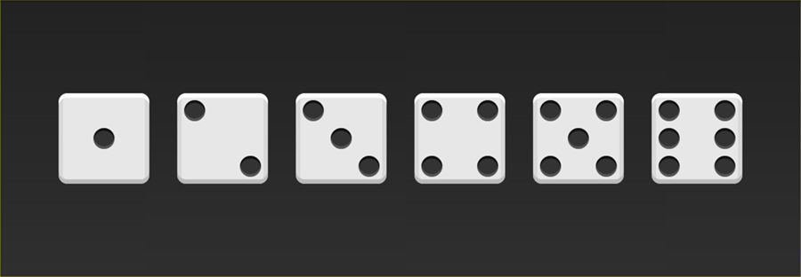

#Page 1
---
		## What Flexbox is?

		- A new CSS layout system that makes it easy to build dynamic layouts. 						


#Page 2
---
		## Why use Flexbox?

		- Vertical centering
		- Reordering								
		- Allow we do not use float or table anymore 


#Page 3
---
		## When can i use Flexbox?
		
		- Now!
		- Now has supportted almost 94% browsers [http://caniuse.com/#search=flex](http://caniuse.com/#search=flex)


#Page 4
---
		### How to use Flexbox?
		
		- Let's make a simple example to use it!
		
		

#Page 5: Dice One
---
##5-1
---
			###Dice: One

			

			```
				<div class="first-face">
				  <span class="dot"></span>
				</div>
			```

##5-2
---
			###justify-content: center

			

			```
				.first-face {
				  display: flex;

				  justify-content: center;
				}
			```

##5-3
---
			###align-items: center

			

			```
				.first-face {
				  display: flex;

				  justify-content: center;
 
				  align-items: center;
				}
			```
#Page 6: Dice Two
---
##6-1
---
			###Dice: Two

			

			```
				<div class="second-face">
				  <span class="dot"></span>
				  <span class="dot"></span>
				</div>
			```

##6-2
---
			###justify-content: space-between

			

			```
				.second-face {
				  display: flex;
				  justify-content: space-between;
				}
			```

##6-3
---
			###align-self: flex-end

			

			```
				.second-face {
				  display: flex;
				  justify-content: space-between;
				}

				.second-face .dot:nth-of-type(2) {
				  align-self: flex-end;
				}
			```
#Page 7: Dice Three
---
##7-1
---
			###Dice: Three

			

			```
				<div class="third-face">
				  <span class="dot"></span>
				  <span class="dot"></span>
				  <span class="dot"></span>
				</div>
			```

##7-2
---
			###align-self: center

			

			```
				.third-face {
				  display: flex;
				  justify-content: space-between;
				}

				.third-face .dot:nth-of-type(2) {
				  align-self: center;
				}
			```

##7-3
---
			###align-self: flex-end

			

			```
				.third-face {
				  display: flex;
				  justify-content: space-between;
				}

				.third-face .dot:nth-of-type(2) {
				  align-self: center;
				}

				.third-face .dot:nth-of-type(3) {
				  align-self: flex-end;
				}
			```
#Page 8: Dice Four
---
##8-1
---
			###Dice: Four

			

			```
				<div class="fourth-face">
					<div class="face-column">
					  <span class="dot"></span>
					  <span class="dot"></span>
					</div>
					<div class="face-column">
					  <span class="dot"></span>
					  <span class="dot"></span>
					</div>
				</div>
			```

##8-2
---
			###justify-content: space-between

			

			```
				.fourth-face {
				  display: flex;
				  justify-content: space-between;
				}
			```

##8-2-alert
---
			###highlight face-column

			
			
			```
				<div class="fourth-face">
					<div class="face-column" style="outline: 1px solid red">
					  <span class="dot"></span>
					  <span class="dot"></span>
					</div>
					<div class="face-column" style="outline: 1px solid red">
					  <span class="dot"></span>
					  <span class="dot"></span>
					</div>
				</div>
			```

##8-3-alert
---
			###nested flexbox

			

			```
				.fourth-face {
				  display: flex;
				  justify-content: space-between;
				}

				.fourth-face .face-column {
				  display: flex;
				  /* default 
				  	flex-direction: row; // left to right 
				  */
				}
			```

##8-4
---
			###nested flexbox

			

			```
				.fourth-face {
				  display: flex;
				  justify-content: space-between;
				}

				.fourth-face .face-column {
				  display: flex;
				  flex-direction: column; // top to bottom
				  justify-content: space-between; 
				}
			```
#Page 9: Dice Five
---
##9-1
---
			###Dice: Five

			

			```
				<div class="fifth-face">
				  <div class="column">
				    <span class="dot"></span>
				    <span class="dot"></span>
				  </div>
				  <div class="column">
				    <span class="dot"></span>
				  </div>
				  <div class="column">
				    <span class="dot"></span>
				    <span class="dot"></span>
				  </div>
				</div>
			```

##9-2
---
			###Dice: Five

			

			```
				.fifth-face {
				  display: flex;
				  justify-content: space-between;
				}
				  
				.fifth-face .column {
				  display: flex;
				  flex-direction: column;
				  justify-content: space-between;
				}
			```

##9-3
---
			###Dice: Five

			

			```
				.fifth-face {
				  display: flex;
				  justify-content: space-between;
				}
				  
				.fifth-face .column {
				  display: flex;
				  flex-direction: column;
				  justify-content: space-between;
				}
				  
				.fifth-face .column:nth-of-type(2) {
				  justify-content: center;
				}
			```
#Page 10: Dice Six
---
##10-1
---
			###Dice: Six

			

			```
				<div class="sixth-face">
				  <div class="column">
				    <span class="dot"></span>
				    <span class="dot"></span>
				    <span class="dot"></span>
				  </div>
				  <div class="column">
				    <span class="dot"></span>
				    <span class="dot"></span>
				    <span class="dot"></span>
				  </div>
				</div>
			```

##10-2
---
			###Dice: Six

			

			```
				.sixth-face {
				  display: flex;
				  justify-content: space-between;
				}
				  
				.sixth-face .column {
				  display: flex;
				  flex-direction: column;
				  justify-content: space-between;
				}
			```